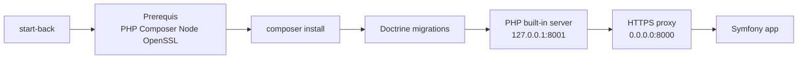
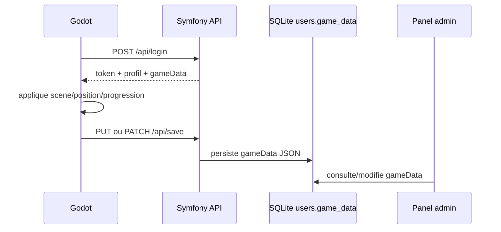

# Back Symfony - Fantasy Adventure

Ce dossier contient le serveur du projet Fantasy Adventure : API JSON, panel administrateur, landing page, proxy HTTPS local et build web Godot servi sur `/play`.

## Lancement Cle En Main

macOS / Linux :

```bash
./start-back.sh
```

Windows PowerShell :

```powershell
.\start-back.ps1
```

Les scripts font le setup au premier lancement, puis un check rapide aux lancements suivants :

- verification de PHP >= 8.4, Composer, Node et OpenSSL ;
- installation Composer si `vendor/` est absent ou obsolete ;
- creation du certificat HTTPS local si absent ;
- execution des migrations Doctrine ;
- lancement du serveur PHP interne sur `127.0.0.1:8001` ;
- lancement du proxy HTTPS sur `0.0.0.0:8000`.



URLs :

- `https://127.0.0.1:8000`
- `https://127.0.0.1:8000/play`
- `https://127.0.0.1:8000/admin`
- `https://<ip-locale>:8000` pour les autres appareils du reseau.

## Composants

```text
Back/
├── src/
│   ├── Controller/
│   │   ├── Api/AuthController.php    # Auth + sauvegardes
│   │   ├── AdminController.php       # Panel admin
│   │   └── LandingController.php     # Landing + /play
│   ├── Entity/User.php               # Compte joueur + game_data JSON
│   ├── EventSubscriber/              # Bootstrap admin/schema
│   └── DataFixtures/                 # Admin de dev
├── config/                           # Doctrine, routes, CORS
├── migrations/                       # Schema SQLite
├── public/index.php                  # Front controller
├── tools/https-proxy.mjs             # Proxy HTTPS dev
└── var/
    ├── data.db                       # Base SQLite
    ├── dev-certs/                    # Certificats HTTPS locaux
    ├── log/                          # Logs des scripts
    └── play/                         # Export web Godot
```

## API

| Methode | Route | Description |
| --- | --- | --- |
| `POST` | `/api/register` | Cree un compte joueur |
| `POST` | `/api/login` | Connecte un joueur et retourne un token |
| `GET` | `/api/me` | Retourne le profil du token courant |
| `PUT` | `/api/save` | Remplace completement `gameData` |
| `PATCH` | `/api/save` | Fusionne partiellement `gameData` |

Header authentifie :

```http
Authorization: Bearer <token>
```

Exemple de sauvegarde :

```json
{
  "gameData": {
    "playerState": {
      "scenePath": "res://scenes/node_2d.tscn",
      "position": {"x": 120, "y": -40}
    },
    "worldState": {
      "coins": 156,
      "hp": 4,
      "maxHp": 5,
      "slimesKilled": 6,
      "unlockedIslands": ["island_1", "island_2"]
    },
    "settings": {
      "locale": "fr"
    }
  }
}
```

## Flux De Sauvegarde



## Panel Admin

Acces :

```text
https://127.0.0.1:8000/admin
```

Fonctions :

- creation et edition de comptes ;
- droits admin ;
- lecture du resume de progression ;
- consultation/modification du JSON `gameData` ;
- suppression de joueurs.

Comptes de developpement :

- `admin@game.com` / `admin123` si les fixtures ont ete chargees ;
- `admin@fantasy-adventure.local` / `admin1234` cree automatiquement si absent.

## Export Web

Le build web Godot doit etre place dans :

```text
Back/var/play/index.html
```

Route exposee :

```text
https://127.0.0.1:8000/play
```

Commande macOS pour regenerer l'export depuis la racine du projet :

```bash
/Applications/Godot.app/Contents/MacOS/Godot \
  --headless \
  --path Godot \
  --export-release Web ../Back/var/play/index.html
```

## Base De Donnees

- Driver : SQLite
- Fichier : `var/data.db`
- Entite principale : `App\Entity\User`
- Colonne de sauvegarde : `game_data` JSON

Les scripts de lancement executent les migrations, mais ne suppriment pas la base et ne chargent pas automatiquement les fixtures pour eviter d'ecraser les sauvegardes.
