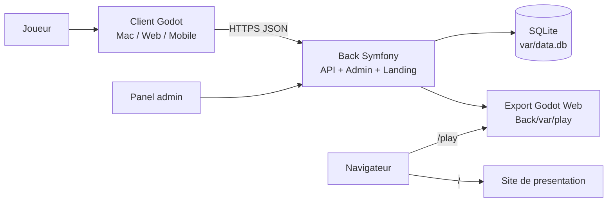
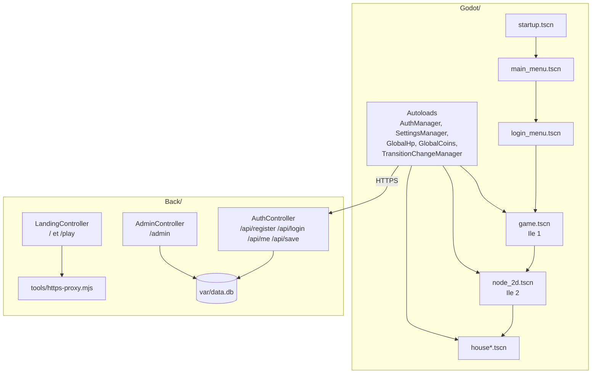
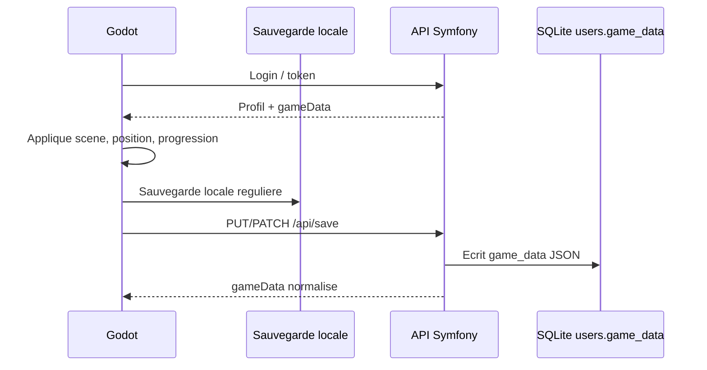

# Fantasy Adventure

Fantasy Adventure est un jeu d'aventure pixel-art realise avec Godot 4.6 et un back Symfony. Le projet combine un client jouable en desktop/mobile/web, un serveur HTTPS local pour l'API, une page de presentation, un export web accessible via `/play`, et un systeme de sauvegarde utilisateur stocke en JSON dans la base SQLite.

## Vue D'ensemble



Le jeu est compose de plusieurs scenes Godot : ile principale, deuxieme ile, maisons, menus, HUD, carte, inventaire, controles mobiles et systeme de transition. Le serveur gere les comptes, les tokens API, le panel administrateur et la synchronisation des sauvegardes.

## Fonctionnalites Actuelles

- Connexion/inscription via API Symfony.
- Sauvegarde en ligne dans `users.game_data` au format JSON.
- Fallback local cote Godot si le serveur n'est pas disponible.
- Position du joueur sauvegardee par scene.
- Etat du monde sauvegarde : pieces, vie, progression, quete, ennemis/slimes, scene courante.
- Parametres utilisateur sauvegardes, dont les touches personnalisees.
- Panel administrateur pour consulter/modifier les joueurs et leur JSON de sauvegarde.
- Export web Godot servi par Symfony sur `/play`.
- Interface mobile avec joystick et boutons tactiles.
- Inventaire visuel et selection d'items.
- Carte avec changement d'ile selon la progression.
- Menus pause, carte et inventaire avec calques UI dedies.
- Site de presentation servi par le back.

## Architecture

Livrable attendu : Produire le schéma d’architecture => communications entre le front, le back, la BDD et le moteur de jeu.



## Structure Du Projet

```text
fantasy-adventure/
├── Back/                 # Serveur Symfony, API, admin, landing, export web
│   ├── src/              # Controllers, Entity User, fixtures, subscriber DB
│   ├── config/           # Doctrine, routes, CORS, services
│   ├── migrations/       # Migrations SQLite
│   ├── public/           # Front controller Symfony
│   ├── tools/            # Proxy HTTPS local
│   ├── var/              # DB SQLite, certificats, cache, export web
│   ├── start-back.sh     # Setup + lancement macOS/Linux
│   └── start-back.ps1    # Setup + lancement Windows
├── Godot/                # Projet Godot 4.6
│   ├── scenes/           # Scenes principales, maisons, menus, joueur
│   ├── scripts/          # Managers, UI, gameplay, sauvegarde
│   ├── assets/           # Sprites, sons, fonts, tilesets
│   ├── dialogues/        # Dialogue Manager
│   └── project.godot
├── Builds Clients/       # Builds natifs
├── index.html            # Landing page source
└── background-image.png  # Image de fond de la landing
```

## Lancement Rapide

### macOS / Linux

```bash
cd Back
./start-back.sh
```

### Windows

```powershell
cd Back
.\start-back.ps1
```

Au premier lancement, le script prepare l'environnement : dependances Composer, base SQLite, migrations, certificats HTTPS locaux, puis lancement du serveur. Aux lancements suivants, il verifie rapidement que tout est pret puis demarre le back.

URLs par defaut :

- Site : `https://127.0.0.1:8000`
- Jeu web : `https://127.0.0.1:8000/play`
- Admin : `https://127.0.0.1:8000/admin`
- API : `https://127.0.0.1:8000/api`
- Reseau local : `https://<ip-du-pc>:8000`

> Le certificat est auto-signe pour le developpement. Le navigateur peut demander de l'accepter la premiere fois.

## Lancer Le Jeu Dans Godot

1. Ouvrir `Godot/project.godot` avec Godot 4.6.
2. Lancer la scene principale `res://scenes/startup.tscn`.
3. Verifier que le serveur pointe vers `https://127.0.0.1:8000` ou l'IP LAN de la machine qui lance le back.

Touches par defaut :

| Action | Touche |
| --- | --- |
| Pause / retour | `Esc` |
| Inventaire | `T` |
| Carte | `M` |
| Interagir | `E` |
| Attaquer | `K` |
| Saut | `Space` |
| Accroupir | `Shift` |
| Deplacement | Fleches / ZQSD-WASD selon layout |

Les touches peuvent etre modifiees depuis les settings. Les doublons sont signales en rouge.

## Sauvegarde

La sauvegarde joueur est stockee dans la colonne JSON `game_data` de la table `users`. Godot conserve aussi un etat local pour continuer a fonctionner hors ligne.



Exemples de donnees sauvegardees :

- scene courante et position du joueur ;
- vie, pieces, inventaire selectionne ;
- progression de quetes et iles debloquees ;
- slimes/ennemis morts ou avec PV modifies ;
- bindings clavier et parametres ;
- metadata de sauvegarde (`schemaVersion`, dates de sync).

## API Principale

| Methode | Route | Role |
| --- | --- | --- |
| `POST` | `/api/register` | Creer un compte joueur |
| `POST` | `/api/login` | Connecter et recuperer un token |
| `GET` | `/api/me` | Lire le profil courant |
| `PUT` | `/api/save` | Remplacer `gameData` |
| `PATCH` | `/api/save` | Fusionner partiellement `gameData` |
| `GET/POST` | `/admin` | Panel admin |
| `GET` | `/play` | Export web Godot |

Authentification API :

```http
Authorization: Bearer <token>
Content-Type: application/json
```

## Export Web Godot

L'export web est servi depuis `Back/var/play`. Pour regenerer le build web :

```bash
/Applications/Godot.app/Contents/MacOS/Godot \
  --headless \
  --path Godot \
  --export-release Web ../Back/var/play/index.html
```

Ensuite ouvrir :

```text
https://127.0.0.1:8000/play
```

## Panel Administrateur

Le panel `/admin` permet de :

- lister les joueurs ;
- creer/modifier/supprimer des comptes ;
- consulter la sauvegarde JSON d'un joueur ;
- modifier manuellement `gameData` ;
- visualiser des resumes : progression, position, settings, touches.

Comptes admin de developpement possibles selon la base :

- `admin@game.com` / `admin123` via fixtures ;
- `admin@fantasy-adventure.local` / `admin1234` via bootstrap automatique.

## Notes De Developpement

- Le back utilise SQLite : `Back/var/data.db`.
- Le proxy HTTPS Node redirige `https://0.0.0.0:8000` vers `http://127.0.0.1:8001`.
- Les scripts `start-back.*` ne suppriment pas la base et ne rechargent pas les fixtures automatiquement.
- Les fichiers ignores par Git ont ete commentes volontairement, sauf `.DS_Store`, pour faciliter les livrables/prototypes.
- Les logs back sont dans `Back/var/log`.

## Licence

Projet sous licence MIT. Voir [LICENSE](LICENSE).
